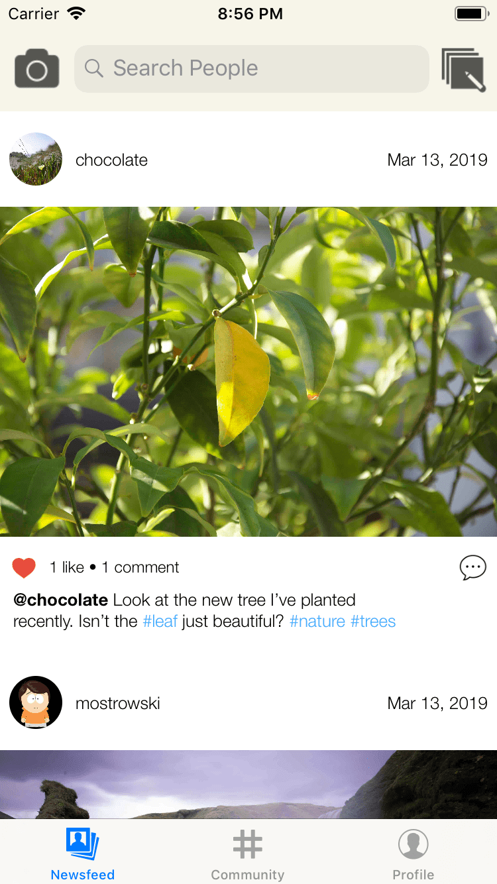
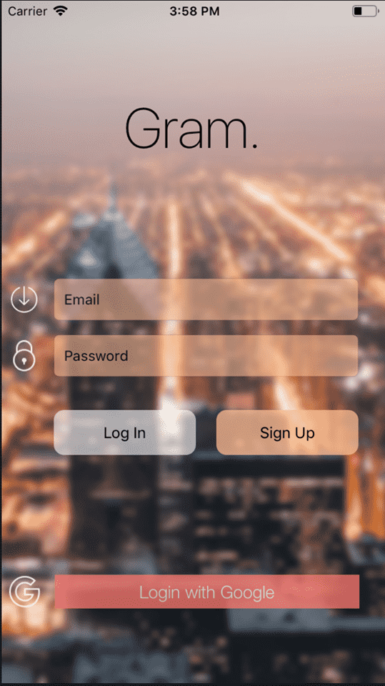
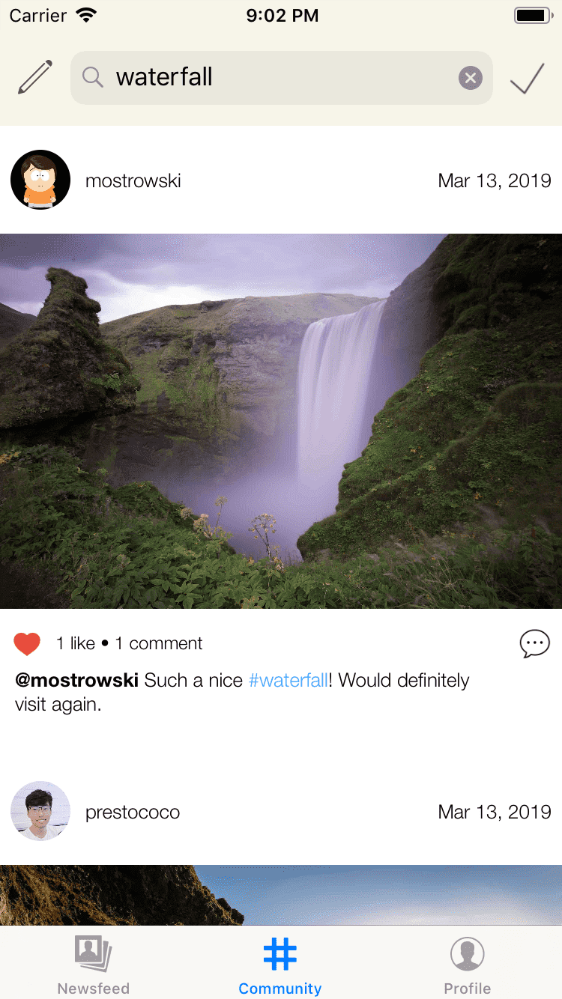

# Gram.

An exercise to clone the Instagram app. This full-stack iOS application comes with basic features users often interact with on the actual Instagram app, including:

- Posting photos
- Add caption
- Liking photos
- Comment
- Follow users
- Search users
- Search hashtags
- Personal profile page

The front end was developed using pure Swift and the backend is powered by Google Firebase, specifically Firebase Realtime Database and Firebase Authentication.

Other contributers: **Matthew Ostrowski, Jess Nguyen, Jacob Morris**

## Screenshots

|            |            |
|------------|------------|
|  |  |
|  |  |
